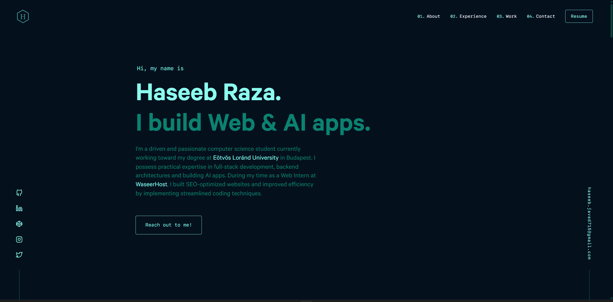

<div align="center">
  
</div>

<h1 align="center">
  haseeb.dev
</h1>

<p align="center">
  Personal portfolio website built with <a href="https://www.gatsbyjs.com/" target="_blank">Gatsby</a> and hosted on <a href="https://www.netlify.com/" target="_blank">Netlify</a>.
</p>




---

## 📖 Table of Contents

- [About](#-about)
- [Installation & Setup](#-installation--setup)
- [Building for Production](#-building-and-running-for-production)
- [Inspiration](#-inspiration)
- [License](#-license)

---

## 📌 About

This is the personal portfolio of **Haseeb Raza**, showcasing selected projects, resume, and contact information. It is designed for developers, designers, and recruiters to explore Haseeb's skills and work.

---

## 🛠 Installation & Setup

Follow these steps to set up the project locally:

1. **Install the Gatsby CLI**

   ```bash
   npm install -g gatsby-cli
   ```

2. **Install and use the correct Node.js version with [NVM](https://github.com/nvm-sh/nvm)**

   ```bash
   nvm install
   nvm use
   ```

3. **Install project dependencies**

   ```bash
   yarn install
   ```

4. **Start the development server**

   ```bash
   npm start
   ```

   The site will be available at `http://localhost:8000`.

---

## 🚀 Building and Running for Production

1. **Generate a full static production build**

   ```bash
   npm run build
   ```

2. **Preview the production build locally**

   ```bash
   npm run serve
   ```

   The preview will be available at `http://localhost:9000`.

---

## 🎨 Inspiration

The design is inspired by [brittanychiang.com](https://brittanychiang.com), restructured with a personalized theme and layout.

---

## 📜 License

This project is licensed under the [MIT License](LICENSE).
