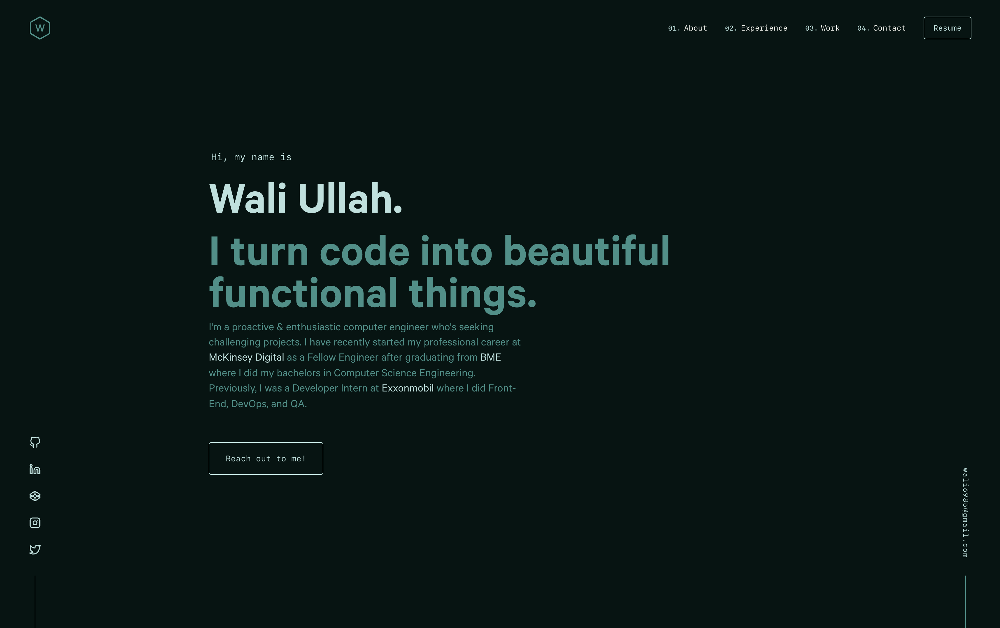

Here is your fully updated `README.md` rewritten for **Haseeb Raza**, with all references to `haseeb.dev` replaced and branding, links, and wording aligned with your current project:

---

````md
<div align="center">
  
</div>

<h1 align="center">
  haseeb.dev
</h1>

<p align="center">
  Personal portfolio website, built with <a href="https://www.gatsbyjs.org/" target="_blank">Gatsby</a> and hosted on <a href="https://www.netlify.com/" target="_blank">Netlify</a>.
</p>

<p align="center">
  <a href="https://app.netlify.com/sites/haseeb/deploys" target="_blank">
    
  </a>
</p>



---

## 🛠 Installation & Set Up

1. **Install the Gatsby CLI**

   ```sh
   npm install -g gatsby-cli
````

2. **Install and use the correct version of Node using [NVM](https://github.com/nvm-sh/nvm)**

   ```sh
   nvm install
   ```

3. **Install dependencies**

   ```sh
   yarn
   ```

4. **Start the development server**

   ```sh
   npm start
   ```

---

## 🚀 Building and Running for Production

1. **Generate a full static production build**

   ```sh
   npm run build
   ```

2. **Preview the site as it will appear once deployed**

   ```sh
   npm run serve
   ```

---

## 📌 About

This is the personal portfolio of **Haseeb Raza**, showcasing selected projects, resume access, and contact information.
Built for developers, designers, and recruiters looking to explore Haseeb's work.

---

### 🎨 Inspiration

Design inspired by [brittanychiang.com](https://brittanychiang.com), restructured with a personalized theme and layout.


